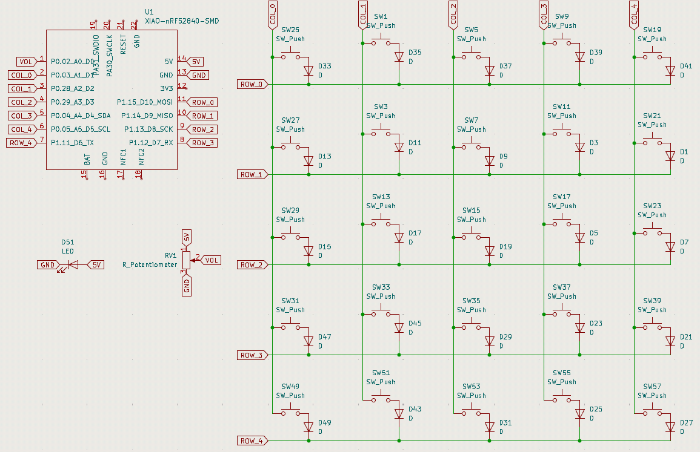

# heidi keyboard
err, yeah, a simple keyboard, with a led and, um, a potentiometer for volume or , thats it, and very ergonomic (until i make the 3D case lmao), and um idk...
and, uh, here is the img of the current schema

